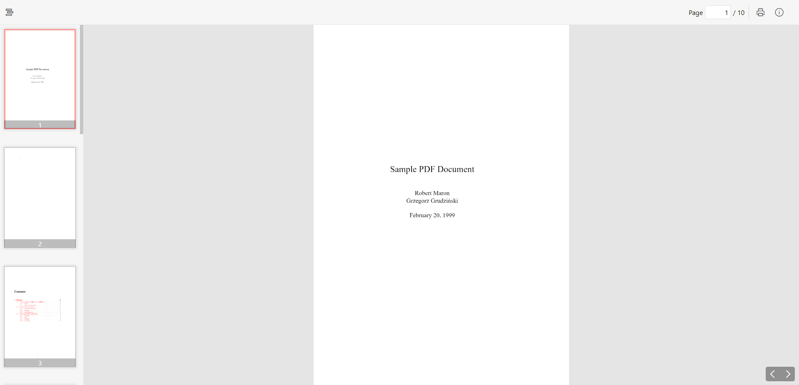

# React PDF Viewer Component
 

A powerful and flexible PDF viewer component for your React.js projects. This component allows for an enhanced PDF viewing experience with features like a preview navigator sidebar, quick page access, and seamless zoom capabilities, making it suitable for both mobile devices and PCs.

## Features

- **Preview Navigator Sidebar**: Easily navigate through your PDF document with a dedicated sidebar.
- **Quick Page Access**: Jump to any page by entering the page number for instant navigation.
- **Scroll to Zoom**: Use scroll gestures to zoom in and out of the document.
- **Pinch and Zoom**: Supports pinch-to-zoom functionality for touch devices.
- **Mobile and PC Friendly**: Designed to work seamlessly on both mobile and desktop environments.

## Screenshots


## Installation

You can install the component via npm by running the following command:

```bash
npm i pdf-viewer-reactjs-component
```
## Usage

To use the `react-js-pdfviewer-component` in your project, import it and include it in your component tree:

```javascript
import React from 'react';
import PDFViewer from 'pdf-viewer-reactjs-component/dist/components/PDFViewer';

const App = () => {
  return (
    <div className="App">
      <PDFViewer url={"https://www.aeee.in/wp-content/uploads/2020/08/Sample-pdf.pdf"}/>
    </div>
  ); 
};

export default App;
```
Make sure that, You have set the height and width of the container properly.
